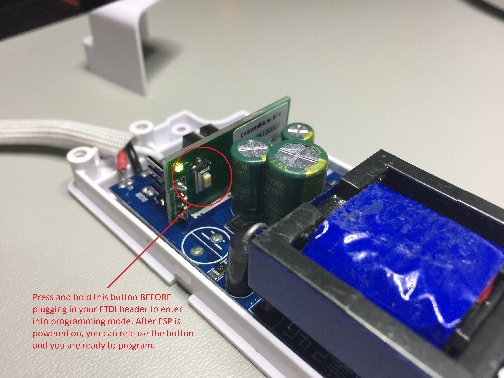

# SonoffLED-HomeAssistant


SonoffLED-HomeAssistant is alternative firmware for the [ITEAD Sonoff LED - WiFi Controllable LED Strip](https://www.itead.cc/sonoff-led.html?acc=70efdf2ec9b086079795c442636b55fb) that allows you to use your own mqtt broker rather than the pre-defined 'ITEAD CLOUD' service that is shipped with the firmware in the unit. The firmware is specifically written for the [Home Assistant](https://home-assistant.io/) mqtt [light](https://home-assistant.io/components/light.mqtt/) component and how that component publishes commands and expects to receive status updates etc, but it can of course be used with any other mqtt broker and Home Automation system with very little modification.

It's designed to be installed with the Arduino IDE and has been tested on Arduino 1.6.13 but should be backwards & forwards compatible with other versions. 

Speaking of Home Assistant, I have included a snippet of how to setup the [light](https://home-assistant.io/components/light.mqtt/) in configuration.yaml as well.

And finally, I did this to help beginners get up and running quickly with HomeAssistant and the Sonoff LED product.

# Installation

## 1. Clone the Repository

Clone the **SonoffLED-HomeAssistant** repository to your local machine.

``` bash
$ git clone https://github.com/KmanOz/SonoffLED-HomeAssistant
```

## 2. Clone the lmroy/pubsubclient mqtt library to your local machine.

I use the [lmroy](https://github.com/Imroy/pubsubclient) version of this excellent mqtt library specifically written for the ESP8266, mainly because it supports QOS1 and keepalive settings right from within the sketch. No other modifications to library files are necessary to achieve a rock solid connection to your mqtt broker.

It's currently setup to use only v3.1.1 of the mqtt standard and will only work on that version broker unless you modify the code so make sure your broker is setup to use v3.1.1 of the mqtt standard and not v3.1.

``` bash
$ git clone https://github.com/Imroy/pubsubclient
```

## 3. Flash the software to the Sonoff LED

First, you need to install a 4 pin header onto the the vertical ESP module which is located on the output side of the WiFi Controlled power supply.


After you have installed the header, press and hold the button before you plug in your FTDI cable. You are then good to go to re-flash your new firmware.



## 4. Modify the details in the Arduino code to your specific details and environment.

**** IMPORTANT **** MQTT_CLIENT needs to be unique for each Sonoff LED you install. MQTT_USER & MQTT_PASS can be the same but consider MQTT_CLIENT to be the equivalent of a MAC address. MQTT_CLIENT is how your broker identifies what hardware (or software for that matter) is talking to the broker at any one time and needs to be unique. So does MQTT_TOPIC unless you want 2 LED units to respond to 1 topic (and 1 switch in HA).

``` bash
#define MQTT_CLIENT        "Sonoff_LED_strip_v1.0"                      // mqtt client_id (Must be unique for each LED)
#define MQTT_SERVER        "192.168.1.100"                              // mqtt server
#define MQTT_PORT          1883                                         // mqtt port
#define MQTT_TOPIC         "home/sonoff_led/living_room"                // mqtt topic (Base topic)
#define MQTT_BRIGHT_TOPIC  "home/sonoff_led/living_room/brightness"     // mqtt topic (Brightness topic)
#define MQTT_COLOR_TOPIC   "home/sonoff_led/living_room/color"          // mqtt topic (Color topic)
#define MQTT_USER          "user"                                       // mqtt user
#define MQTT_PASS          "pass"                                       // mqtt password

#define WIFI_SSID          "homepass"                                   // wifi ssid
#define WIFI_PASS          "homewifi"                                   // wifi password
```

## 5. Modify configuration.yaml in HomeAssistant and add the following to it.

```bash
light:
  - platform: mqtt
    name: "Living Room LED"
    command_topic: "home/sonoff_led/living_room"
    state_topic: "home/sonoff_led/living_room/stat"
    brightness_command_topic: "home/sonoff_led/living_room/brightness"
    brightness_state_topic: "home/sonoff_led/living_room/brightness/stat"
    color_temp_command_topic: "home/sonoff_led/living_room/color"
    color_temp_state_topic: "home/sonoff_led/living_room/color/stat"
    qos: 0
    payload_on: "ON"
    payload_off: "OFF"
    optimistic: false
```
Assuming you make no changes to the topic in the code provided, you should be able to test the LED and be happy that you now have control using Home Assistant.

## 6. Commands and Operation

- ON (Turns the LED on)
- OFF (Turns the LED off)
- reset (Forces a restart of the LED Controller) (4 long flashes of the status LED)

When power is first applied the unit will immediately connect to your WiFi access point / router and then your mqtt broker. When it connects the internal status LED will flash fast 4 times. That's it, your connected. If you prefer the LED to TURN ON immediately when power is applied, make sure you set onAtStart = true.

```bash
bool onAtStart = true;
```

In HomeAssistant, turn the LED on and the click on the icon to bring up additional controls. The LED has 3 color modes, COLD ONLY, COLD & WARM and WARM ONLY. Although the UI has a slider, it is actually being used as a switch. In automations, a color value from 154 to 269 will turn on COLD LEDS only, a value from 270 to 384 will turn both COLD and WARM LEDS and finally a value from 385 to 500 will turn the on the WARM LEDS only. Use the Color slider to adjust.


Use the brightness slider to adjust brightness levels from 1 to 255. Slide brightness down to 0 to also turn off the LED. In automations, just set a brightness level, there is no need to turn on the LEDS as well as any brightness level over 0 will turn on the LED as well. 


## 7. Troubleshooting

To assist in troubleshooting I have added a small delay that gives you time to open up a serial window and display all of the debug data correctly. When power is applied you will notice the status LED flashing fast. That's the time to open your Arduino serial console.

```bash
bool debug = true;
```

Make sure to set this to false when you've finished otherwise there will be a delay in the LEDS turning on at power up if you've enabled that option.

## 8. HomeAssistant Community Discussion Forum

For further information and to join the discussion for this firmware please go to the HomeAssistant Community Discussion Forum [ITEAD Sonoff Wireless Smart Switch](https://community.home-assistant.io/t/sonoff-homeassistant-alternative-firmware-for-sonoff-switches-for-use-with-mqtt-ha/2332). I would be happy to answer any of your queries there.

## 9. Conclusion

That's about it. Any feature suggestions are welcome and I would be happy to answer any further questions that you may have.

Enjoy!
